# Image filtering, processing, edge detection, hybrid images
### *Updated on: April 5th, 2021* 

## Results for adding noise, filtering noise and edge detection:
### 1)adding salt and pepper noise and filtering with Gaussian filter
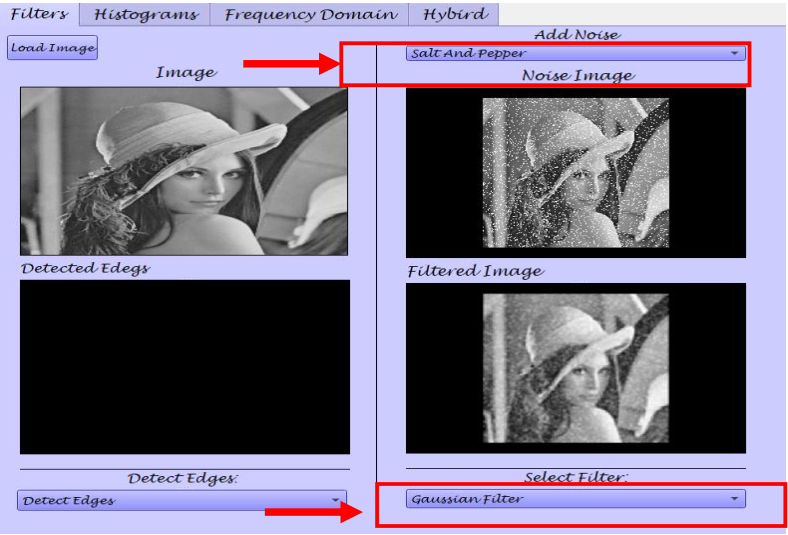
### 2) adding Gaussian noise and using average filter
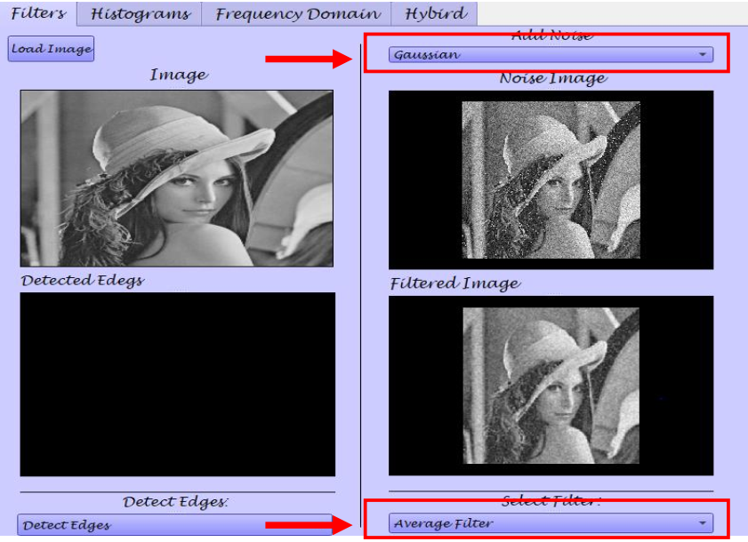
### 3) adding Uniform noise and using Median filter
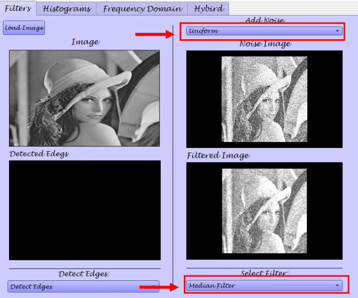
### 4) results for edge detection
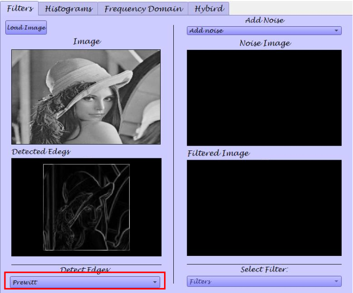

## some processing and histograms
### 1) converting from color to gray
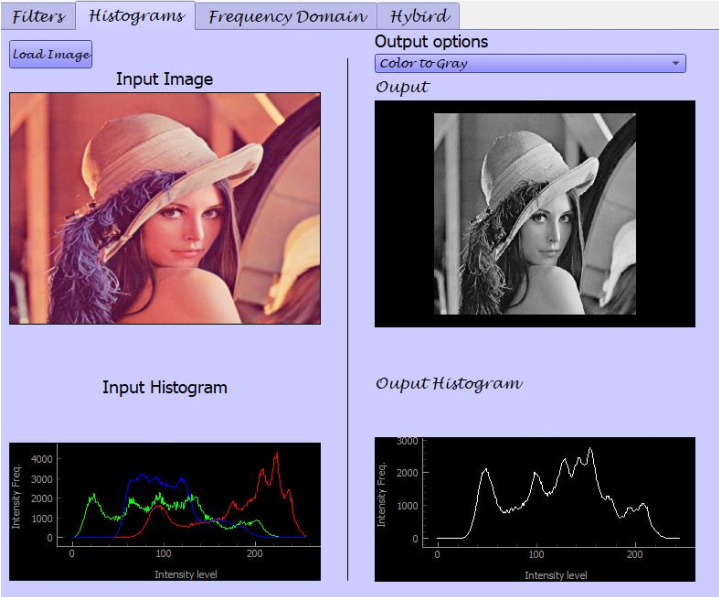
### 2) Image Equalization
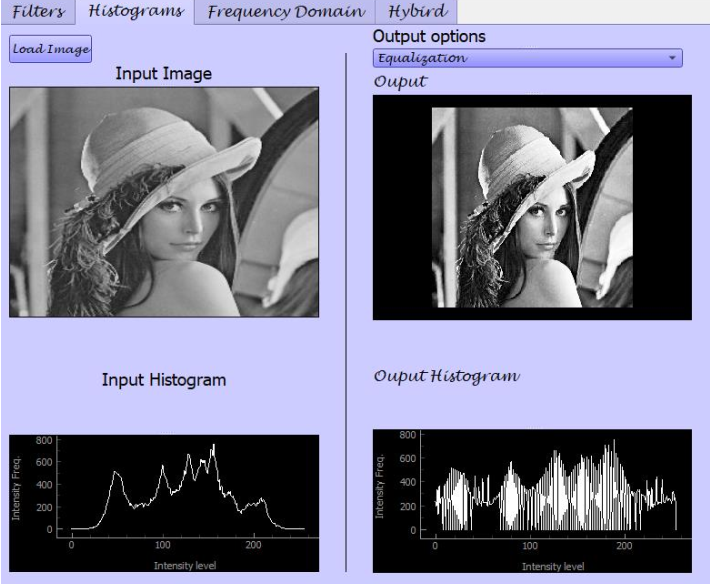
### 3) Image Normalization
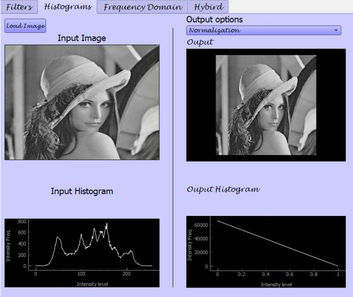
### 4) Global Thresholding
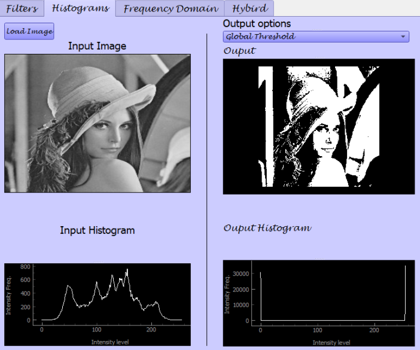
### 5) Local Thresholding
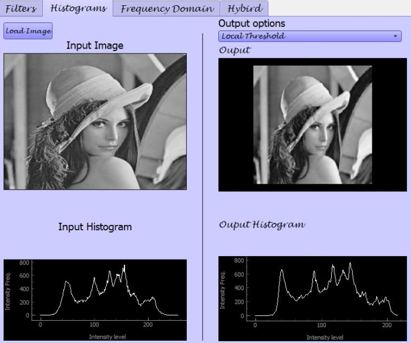
## Frequency Domain Filters
### 1) High pass filter
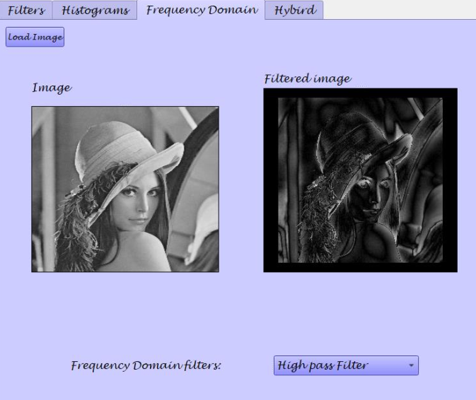
### 2) Low pass filter
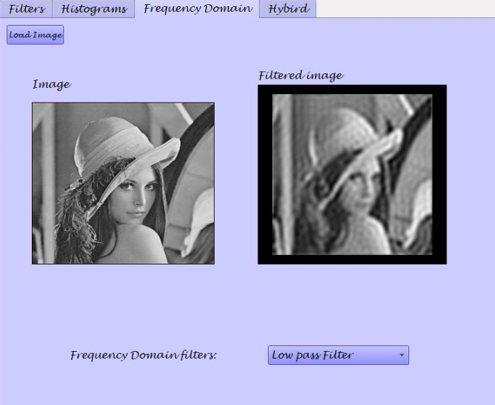

## Hybrid Images
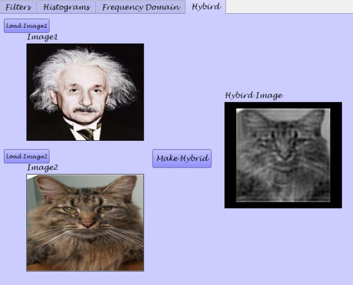

## Team members:
### Irini Adel
### Esraa Sayed
### Amany Bahaa-Eldin
### Alzahraa Eid
