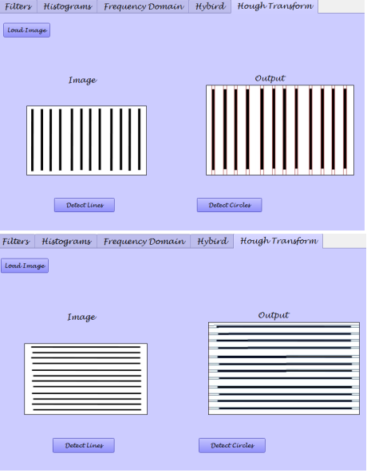
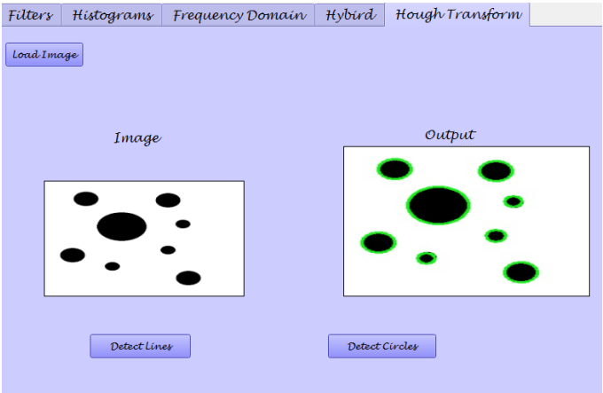
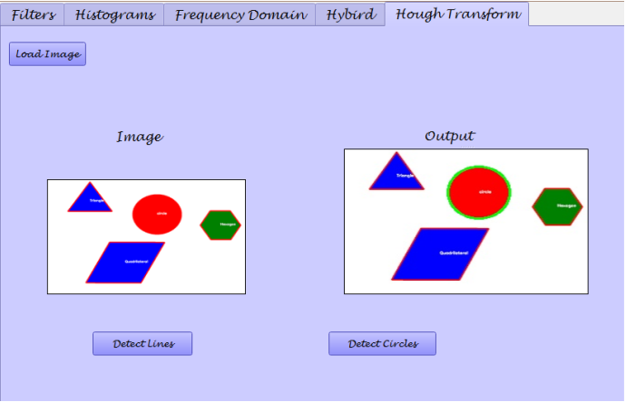
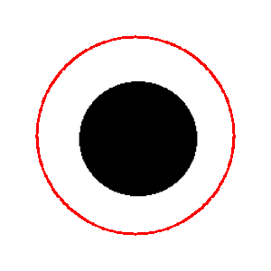
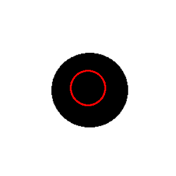
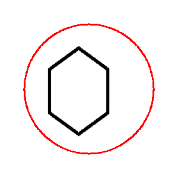
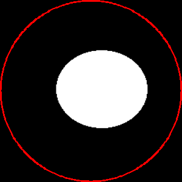
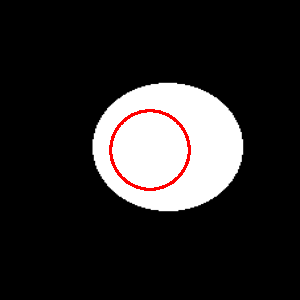
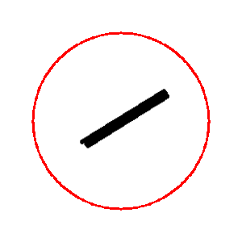
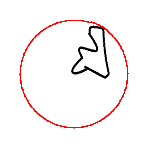

# Edge and boundary detection (Hough transform and SNAKE)
### *Updated on: April 19th, 2021*

## Hough Transform:
### 1. Line Detection with Hough Transform:

### 2. Circle Detection with Hough Transform:
• At minimum radius = 5

• At minimum radius = 10

## Active contour (SNAKE):
### *Results*

## Team members:
### Irini Adel
### Esraa Sayed
### Amany Bahaa-Eldin
### Alzahraa Eid