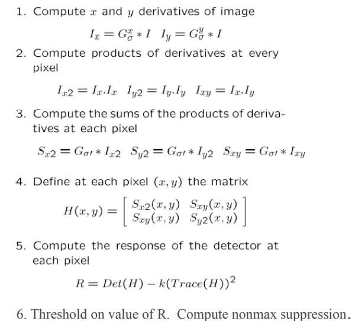
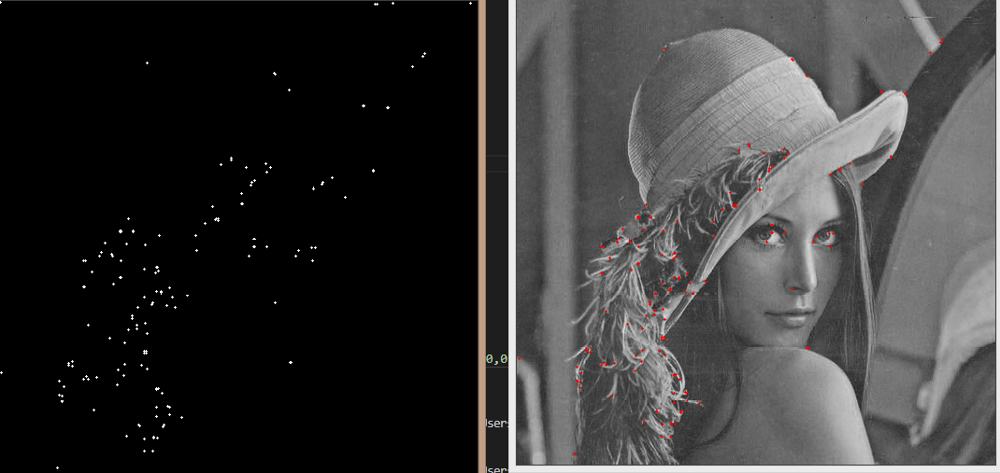
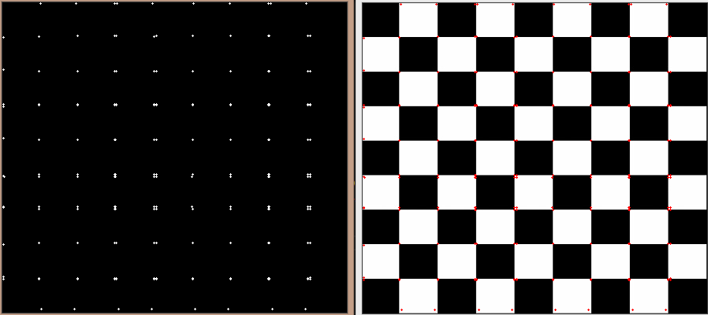
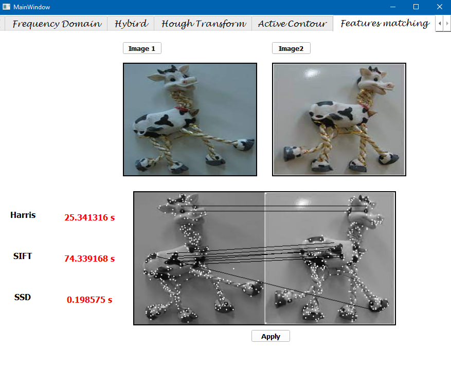
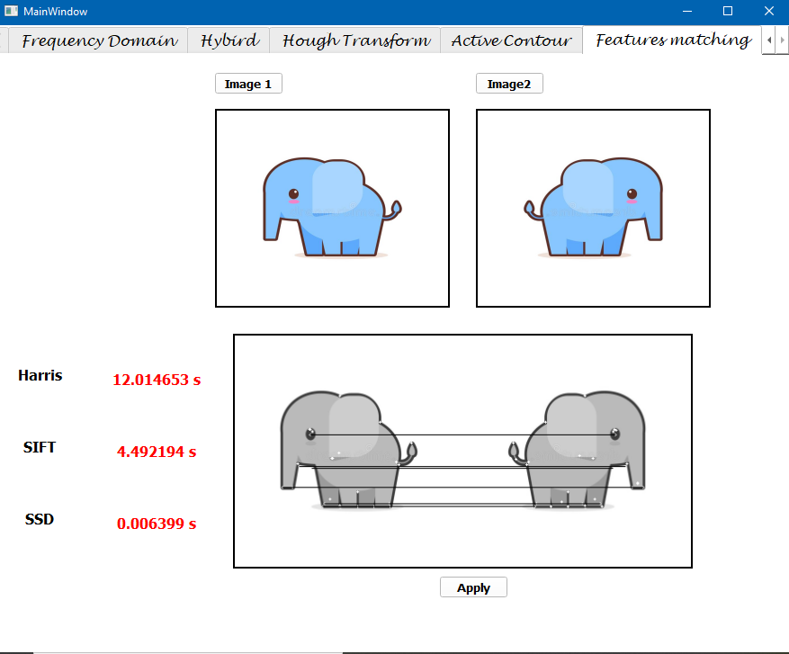

# Feature point detection, features descriptors (SIFT) and image matching
### *Updated on: May 3rd, 2021*

## Corner Detection with Harris
## **How does Harris Algorithm work?**

**Some results reached on running harris alone:**



*In the UI, Computation time for Harris Corners is displayed in the label, but the keypoints resulting from harris were not used to perform the matching (the results displayed are for Harris run alone)*


# SIFT

- We tried a lot to combine the harris function with the sift descriptor but unfortunately we couldn't do that, as harris returns the keypoints in the form of x and y coordinates, but the descriptor needs to get the keypoints in cv2.keypoints data type which should have also the octaves of each keypoint.

- So we used the sift implementation to get the keypoints and then apply the descriptor function on them.

- The results in the UI shows the keypoints generated using sift algorithm.


# Image Matching 


**Step 3: Features Matching**

The function siftmatcher from matcher.py recieves the keypoints and the describtors for the two images to compute the SSD, and return the match and score.

```
def siftmatcher(keypoints_set , descriptors_set):
	keypoint_1 = keypoints_set[0]
	keypoint_2 = keypoints_set[1]
	descriptor_1 = descriptors_set[0]
	descriptor_2 = descriptors_set[1]
 
	diff = descriptor_2 - descriptor_1[:,None]
	squre_of_diff = diff ** 2
	sum_square_diff = squre_of_diff.sum(axis=-1)
	score = np.sqrt(sum_square_diff.min(axis=-1))
	matches = np.argmin(sum_square_diff,axis=-1)
	invalid_matches = score > SIFT_MATCH_THRESHOLD 
	
	score[invalid_matches] = -1
	matches[invalid_matches] = -1
 
	return matches , score
```
Then we draw the matches between the two images with the following code:
```
for i in range (int(len(matches)/2))  :
    match = matches.item(i)
    if match != -1:
         
        cv2.line (sift_matches , (int(((self.keypoints_set[0][i]).pt)[0]) , int(((self.keypoints_set[0][i]).pt)[1])), 
                (int(((self.keypoints_set[1][match]).pt)[0])+width , int(((self.keypoints_set[1][match]).pt)[1])), 
                (0,0 , 255 ) , 1 , 0)

```
and the result is as follows:


Here the variable *SIFT_MATCH_THRESHOLD* was assigned to the value *200*





But the *SIFT_MATCH_THRESHOLD* can be assigned to different values according to the scores of the matching between the two images. 

## Team members:
### Irini Adel
### Esraa Sayed
### Amany Bahaa-Eldin
### Alzahraa Eid