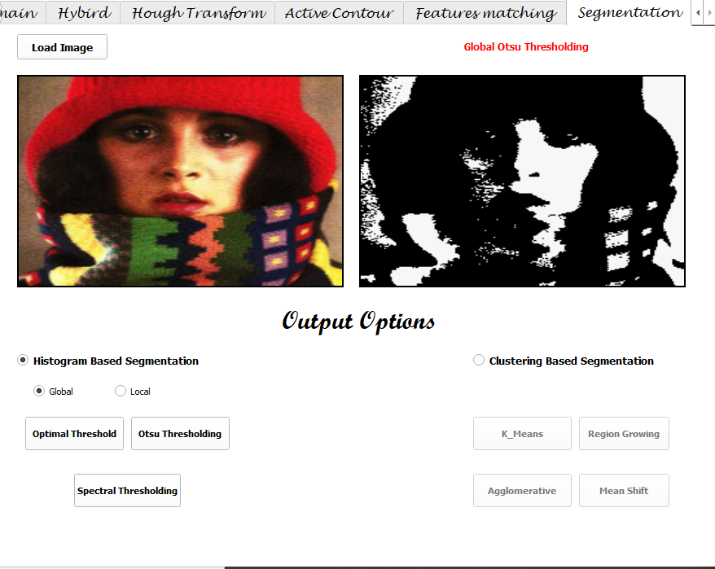
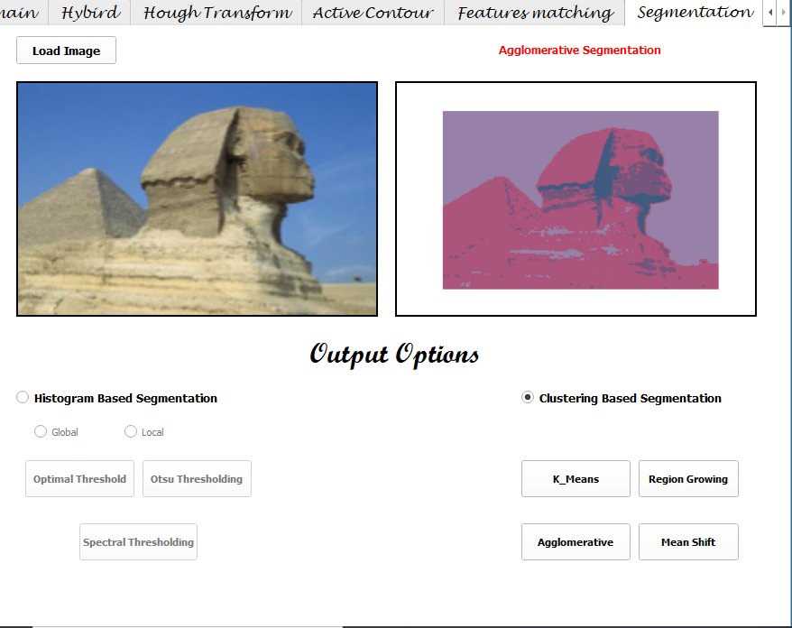

# **Region Based Segmentation**
### *Updated on: May 17th, 2021*
-----------------------------------------------------------------
# *Histogram Based Segmentation*

## 1. Optimal Threshold 

**Global Optimal Threshold**

Optimal thresholding automatic thresholding method for segmentation.

Depends on the following steps:

* step 1: "The initiation step"
  
It initiates the foreground and the background.
The background is initiated by assuming the corner pixels and the rest of the image

* step 2: " calculating the threshold "

It calculates the mean for each of the background and the foreground, then it calculates *t* :
```
t = (background_mean + foreground_mean) / 2
```
* step 3: 

It scanes the image and compares the pixels to the threshold, takes all pixels below the threshold as the background and all pixels higher than threshold as foreground.

* step 4:

It returns to *step 2* to calculate the new threshold, and iterates till having two successive equal thresholds.

```
    back_ground_sum = (img[0,0] + img[0,-1] + img[-1,0] + img[-1,-1])

    foren_ground_sum = np.sum(img) - back_ground_sum
    
    back_ground_mean = back_ground_sum / 4
    

    foren_ground_mean = foren_ground_sum / (np.size(img)-4)
    
    t = (back_ground_mean + foren_ground_mean) / 2
    
    while True:
        back_ground_mean = np.mean(img[img < t])
        
        foren_ground_mean = np.mean(img[img >= t])
        
        if t == ((back_ground_mean + foren_ground_mean) / 2):
            break
        t = (back_ground_mean + foren_ground_mean) / 2
```
*The Result*


**Local Optimal Threshold**

The same steps of the global optimal threshold is followed, but on different regions of the image, not on the whole image.

* step 1:

The image is split into 4 regions of equal size ( we assumed to split it into 4 regions to be able to deal with the concept )

* step 2:

It takes the regions to apply the global optimal threshold on each of them.


```
    for r in range (0,int(image.shape[0]/2)):
        for k in range (0,int(image.shape[1]/2)):
            out_image[r][k] = ((out_image[r][k]) >= t1)*max_pixel_img1
        for u in range (int(image.shape[1]/2), image.shape[1]):
            out_image[r][u] = (out_image[r][u] >= t2)*max_pixel_img2

    for r in range (int(image.shape[0]/2), image.shape[0]):
        for k in range (0,int(image.shape[1]/2)):
            out_image[r][k] = (out_image[r][k] >= t3)*max_pixel_img3
        for u in range (int(image.shape[1]/2), image.shape[1]):
            out_image[r][u] = (out_image[r][u] >= t4)*max_pixel_img4

```

*The Result*


-------------------------------------------

## 2. Otsu Threshold

**Global Otsu Threshold**

Otsu thresholding is a simple yet effective global automatic thresholding method for binarizing grayscale images such as foregrounds and backgrounds.

Depends on reading the gray scale and undergoes the following steps:

* step 1:

Normalizing the entered image to be with pixels in range of (0,255)
```
    im = ((img - img.min()) * (1/(img.max() - img.min())) * 255).astype('uint8')
```

* step 2:

Now we get the histogram for the image
```
    histogram = [np.sum(im == i) for i in range(256)]
```

* step 3:

Initializing an object to store the threshold value and the variance value to reach the maximum varianc and its corresponding threshold

```
    sigma_b_max = (0, -np.inf)
```

* step 4:


The for loop is to iterate on the histogram of the image, and for each detected threshold it calculates the number of pixels and the mean value for the regions below and upper the threshold 
```
    for threshold in range(256):
        # the number of pixels in region below the threshold
        n1 = sum(histogram[:threshold])
        # the number of pixels in region upper the threshold
        n2 = sum(histogram[threshold:])
        # calculating the mean for region below the threshold
        mean1 = sum([i * histogram[i] for i in range(0 , threshold)]) / n1 if n1 > 0 else 0
        # calculating the mean for region upper the threshold
        mean2 = sum([i * histogram[i] for i in range(threshold ,0)]) / n2 if n2 > 0 else 0
```
To calculate the between_variance 
```
        # calculate the between_variance(sigma_b)
        sigma_b = n1 * n2 *(mean1 - mean2) ** 2

```
Then it checks if the resulted between_variance is larger than the stored one in the object *sigma_b_max*, to store tha maximum value
```
        #check if the variance in sigma_b is greater than sigma_b_max
        if sigma_b > sigma_b_max[1]:
            """if true ,it updates the old values in sigma_b_max to keep only the maximum variance
            and the corresponding threshold after iterating"""
            sigma_b_max = (threshold , sigma_b)

```
* step 5:

after the loop terminates, we get the final threshold at which the between_variance is maximized 
    and map it to the image dimensions
```
otsu_th = (sigma_b_max[0] / 255) * (img.max() - img.min()) + img.min()
```

*The Result*




**Local Otsu Threshold**

The same concept of local optimal thresholding, and thr main difference is applying the global otsu thresholding for each region.

*The Result*


-------------------------------------------------------------

## 3. Spectral Threshold

**Global Spectral Threshold**

The basic idea is thresholding the image using multiple thresholds, not only one threshold as mentioned in the previous methods.

* step 1:

We used the global otsu thresholding method to get the first threshold of the image, which splits the image into only 2 regions.


* step 2:

We took the intensity pixels' values below the threshold value and stored them in an array, and the other values higher than the threshold in another array.

* step 3:

Then we applyed the global otsu thresholding on each array of pixels' value to get other 2 thresholds, to split the image into 3 ranges of intensites.

* step 4:

At last, we map each pixel to a certain value depending on the range of intensities where this value locates.

Getting 2 thresholds from the same image:

```
    image_f=image.flatten()
    t=Otsu_threshold(image_f)
    image_lower=[]
    image_higher=[]
    for i in range(len(image_f)):
        if image_f[i]<t:
            image_lower.append(image_f[i])
        else:
            image_higher.append(image_f[i])

    t_low=Otsu_threshold(np.array(image_lower))
    t_high=Otsu_threshold(np.array(image_higher))

```

Applying the 2 thresholds on the image:
```
    t_low , t_high =spectral_th(image)
    rows=image.shape[0]
    cols=image.shape[1]
    max_pixel=image.max()
    out_image=image
    for i in range(rows):
        for k in range(cols):
            pixel = image[i][k]
            if pixel <= t_low:
                out_image[i][k]=0
            elif pixel > (t_high):
                out_image[i][k]=max_pixel
            else:
                out_image[i][k]=max_pixel/2

```
*The Result*


**Local Spectral Threshold**

The same concept of local optimal and local otsu is applied, we split the image into 4 regions, but for each region we get 2 thresholds instead of only 1 threshold.

```
for r in range (0,int(image.shape[0]/2)):
            
    for k in range (0,int(image.shape[1]/2)):
        
        pixel = image[r][k]
        if pixel <= th1:
            out_image[r][k] = 0
        elif pixel > (th2):
            out_image[r][k]=max_pixel_img1
        else:
            out_image[r][k]=(max_pixel_img1/2)
    
    for u in range (int(image.shape[1]/2), image.shape[1]):

        pixel = image[r][u]
        if pixel <= th3:
            out_image[r][u] = 0
        elif pixel > (th4):
            out_image[r][u]=max_pixel_img2
        else:
            out_image[r][u]=(max_pixel_img2/2)
    

for r in range (int(image.shape[0]/2), image.shape[0]):
    
    for k in range (0,int(image.shape[1]/2)):
        pixel = image[r][k]
        if pixel <= th5:
            out_image[r][k] = 0
        elif pixel > (th6):
            out_image[r][k]=max_pixel_img3
        else:
            out_image[r][k]=(max_pixel_img3/2)
    
    for u in range (int(image.shape[1]/2), image.shape[1]):

        pixel = image[r][u]
        if pixel <= th7:
            out_image[r][u] = 0
        elif pixel > (th8):
            out_image[r][u]=max_pixel_img4
        else:
            out_image[r][u]=(max_pixel_img4/2)

```


*The Result*


*Note* about histogram based segmentation:

1. after getting the threshold, we dont map the region higher than it to a specific value  , but we map it to the maximum pixel intensity in the image
```
out_image = (image >= t)*image.max()

```

2. Regarding the spectral thresholding that has 2 thresholds:
```
if pixel <= t_low:
    out_image[i][k]=0
elif pixel > (t_high):
    out_image[i][k]=image.max()
else:
    out_image[i][k]=(image.max())/2

```

3. For local threshold, we deal with each one of the 4 regions in the image according to the maximum intensity in this region.

--------------------------------------------------------------
--------------------------------------------------------------

# Clustering Based Segmentation

## 1. k-mean 

* step 1:

The first step is to randomly initialize a few points. These points are called cluster centroids.

* step 2:

It categorizes each pixel depending on which centroid is closer to it.

* step 3:

The it moves the cluster centroids. Then it is necessary to take an average of all pixels that belong to that cluster.

* step 4:

Now it results in new cluster centroids.

* step 5:

step 2 and 3 need to be repeated several times until both the cluster centroids are in suitable positions


*The Result*

When the number of iterations was 2, the results are:


And when the number of iterations was 2, the results are:


## 2. Region Growing 

The basic idea of region growing is to assemble pixels with similar properties to form regions. Firstly, a seed pixel is found for each region to be segmented as the growth starting point, and then the seed pixel and the pixels in the surrounding neighborhood that have the same or similar properties as the seed pixel are merged into the region where the seed pixel is located. These new pixels are treated as new seeds to continue the above process, so the region grows.

Depends on reading the image and undergoes the following steps:

* step 1:

The implementation starts with Reading the image, setting the threshold, initializing the first seed pixel with a pixel that doesn't belong to a region, initializing *seedMark* seedMark in which the new image is built, cariable for labeling the neghbor pixels and setting the pixel 
```
    thresh=7
    seeds = [Point(10,10),Point(82,150),Point(20,100)]
    seedMark = np.zeros(img.shape)
    seedList = []
    label = 1
    height, width = img.shape
```
Pushing the seed pixel in a stack, where all seeds and the pixels to be seed are stored
```
    seedList = []
    for seed in seeds:
        seedList.append(seed)
```
* step 2:

Taking the seed pixel from the stack as the *currentPoint* (x0, Y0) and (x0, Y0) as the center, consider the 8 neighborhood pixels (x, y) of (x0, Y0).
```
    connects = selectConnects(p)
    while(len(seedList)>0):
        currentPoint = seedList.pop(0)
 
        seedMark[currentPoint.x,currentPoint.y] = label
        for i in range(8):
            tmpX = currentPoint.x + connects[i].x
            tmpY = currentPoint.y + connects[i].y
```

* step 3:

Calculating the difference between the points, If the difference between the two points is below the threshold, merge (x, y) and (x0, Y0) in the same region, and push (x, y) onto the stack to be a new seed pixel

```
            if tmpX < 0 or tmpY < 0 or tmpX >= height or tmpY >= width:
                continue
            grayDiff = getGrayDiff(img,currentPoint,Point(tmpX,tmpY))
            if grayDiff < thresh and seedMark[tmpX,tmpY] == 0:
                seedMark[tmpX,tmpY] = label
                seedList.append(Point(tmpX,tmpY))
```
* Step 4:

Taking a new pixel from the stack and return it to step 2 as the *currentPoint* (x0, Y0)

* step 5:

 when the stack is empty and it has no seed pixel, it returns to step 1, to get a new seed pixel that doesn't belong to a region

* step 6:

It repeats the steps 1 -> 5 till each point in the image has been joined to its close region, and returns the resulted image *seedMark*.


--------------------------------------------------------------
--------------------------------------------------------------
# 3. Agglomerative clustering

## **How does the algorithm work?**

It is bottom-up approach for image segmentation with clustering.

* In the very beginning, each pixel is considered a cluster on its own.
* Then the Euclidean distance is calculated between each pixel and all the other pixels, then these values get stored in a distance matrix.
* The minimum distance is chosen, then the 2 pixels having this distance in between get gathered in a cluster
* The total number of clusters now gets decreased by one.
* Then the previous steps are repeated till the number of clusters (which started initially with the number of pixels) is reduced to a number specified by the user (usually 2,3,4 or 5 clusters).




----------------------------------------------------------------
## Mean Shift Clustering

Mean Shift clustering is a general non-parametric cluster, the output of the mean shift doesn't depend on any explicit assumptions on the shape of the point distribution, the number of clusters, or any form of random initialization.

*How does the algorithm work ?*

The mean shift algorithm seeks modes( the highest density of data points in the region ) of the given set of points:

- choose kernel and bandwidth

- for each point:

  - center a window on that point
  - compute the mean of the data in the search window
  - center the search window at the new mean location
  - Repeat the last 2 steps until convergence

- Assign points that lead to nearby modes to the same cluster


## Team members:
### Irini Adel
### Esraa Sayed
### Amany Bahaa-Eldin
### Alzahraa Eid