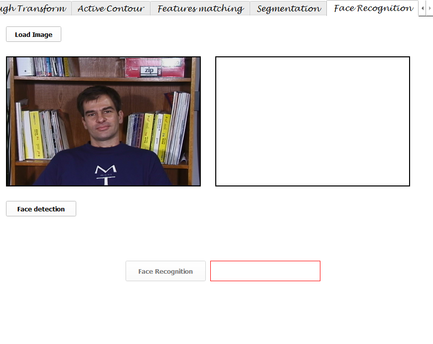
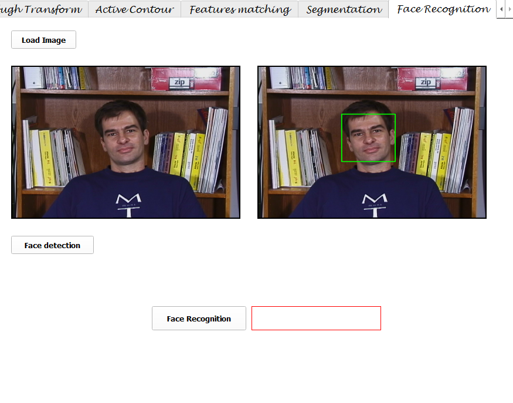
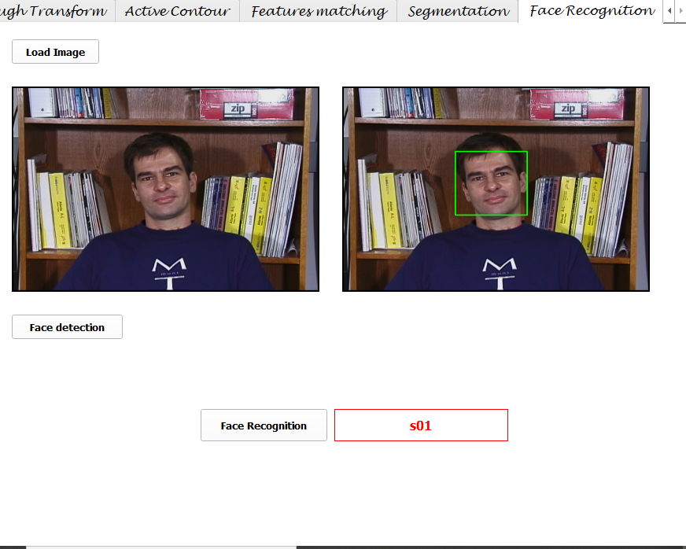
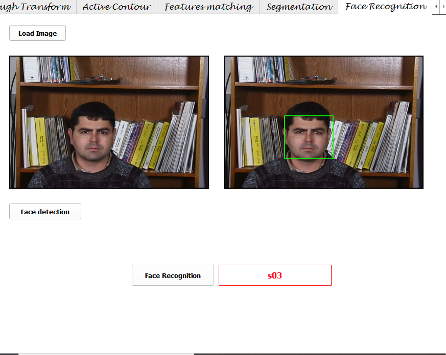
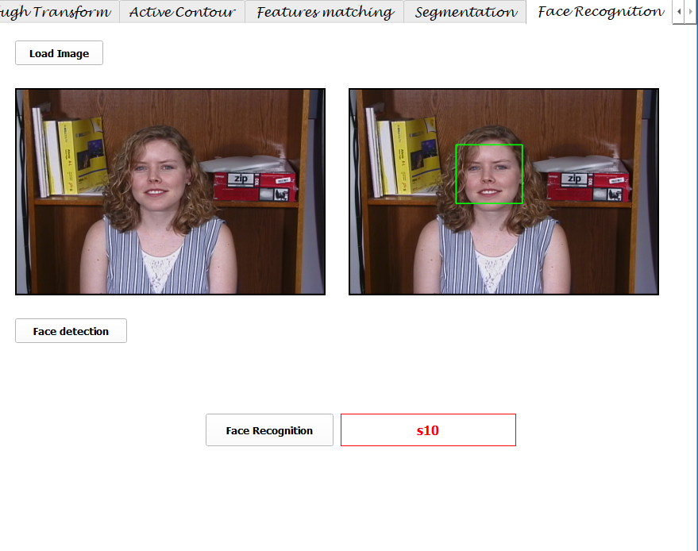
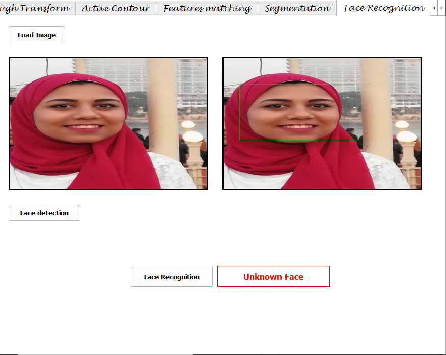
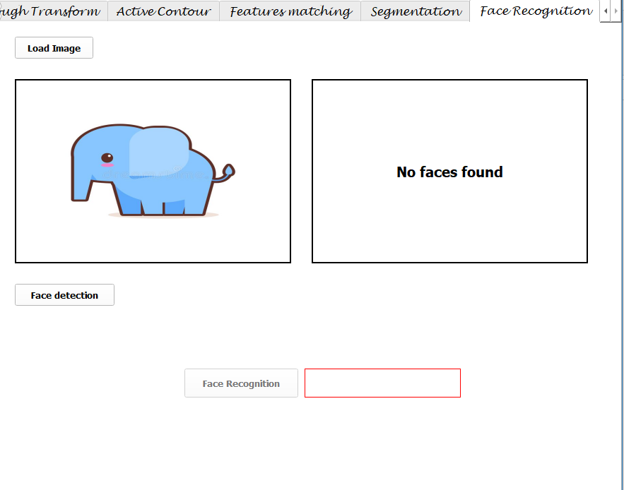

# Task 5: Face Recognition 
### Updated on: *May 31th, 2021*            

### **1.  Face Detection**

This is achieved by using opencv library and **frontal face haar cascade classifier file**. A bounding box is placed on any detected face

### **2. Recognition with PCA**
* Vectorize the images of the training dataset
```
    images_arr = np.array(images_arr)
    images_arr.resize((image_num,resized_shape[0]*resized_shape[1]))
```
* Compute the average face vector
```
    mean_vector = np.sum(images_arr,axis=0,dtype='float64')/image_num
    mean_matrix = np.tile(mean_vector,(image_num,1))
```

* Subtract the average face vector from original images
```
normalize_faces = images_arr - mean_matrix
```

* Calculate the covariance matrix and reduce dimensions
```
Cov_mat_dim_redu = (normalize_faces.dot(normalize_faces.T))/image_num
```
* Calculate the eigenvalues
```
eig_vals,eig_vects = np.linalg.eig(Cov_mat_dim_redu)
```
* Sort eigenvalues in descending order and selecting eigen vectors wih hihest eigen values.
```
idx = eig_vals.argsort()[::-1]
eig_vals = eig_vals[idx]
eig_vects  = eig_vects [:,idx]
```
* Create features weight for training
* Read the testing face image
* Calculate the feature vector of the testing face(Projecting the test image into the face space)
```
E = eigenfaces[:q].dot(mean_sub_testimg)
```
* Compute the Euclidean distance between the test feature vector and all the training feature vector
```
        E_i=eigenfaces[:select_k_vectors].dot(normalize_faces[i])
        diff = E-E_i
        epsilon_i = math.sqrt(diff.dot(diff))
```
* If the euclidean distance is less than a certain threshold, then the face gets recognized as one of the available faces in the dataset, otherwise, then the person is not found.
--------------------------------------------------------------
--------------------------------------------------------------

# **Results:**
Here are few of the screenshots displayed from the ui

* Upload an image


* Face is detected


* Face is recognized and the name of the image is displayed on label



* Uploading a different image and the name of the class is displayed 



* Another recognition performed from a different class



* Here the face is detected but it is not in the database, so it is written on the label (Unknown Face)


* No faces in the image are found, so no bounding box is drawn



## Team members:
### Irini Adel
### Esraa Sayed
### Amany Bahaa-Eldin
### Alzahraa Eid